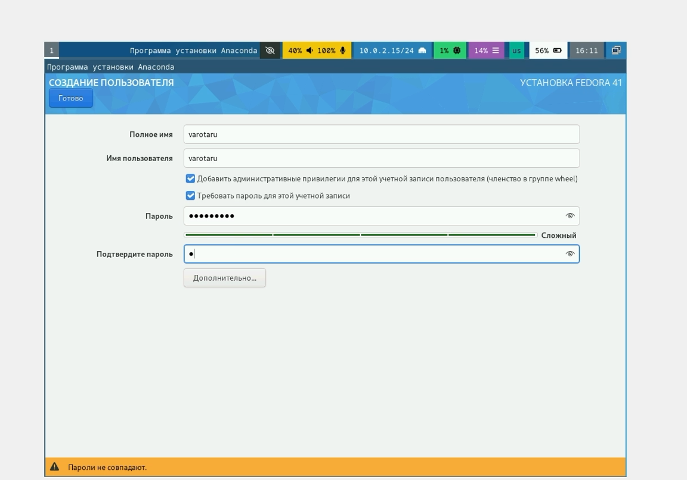
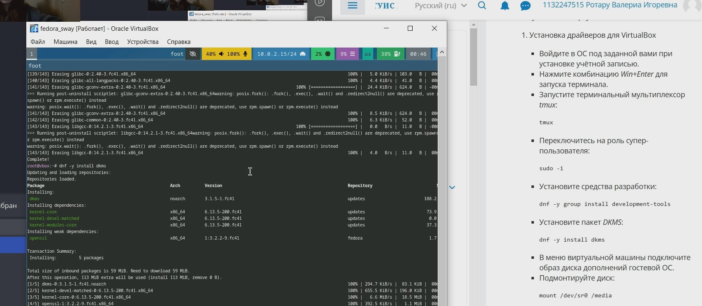
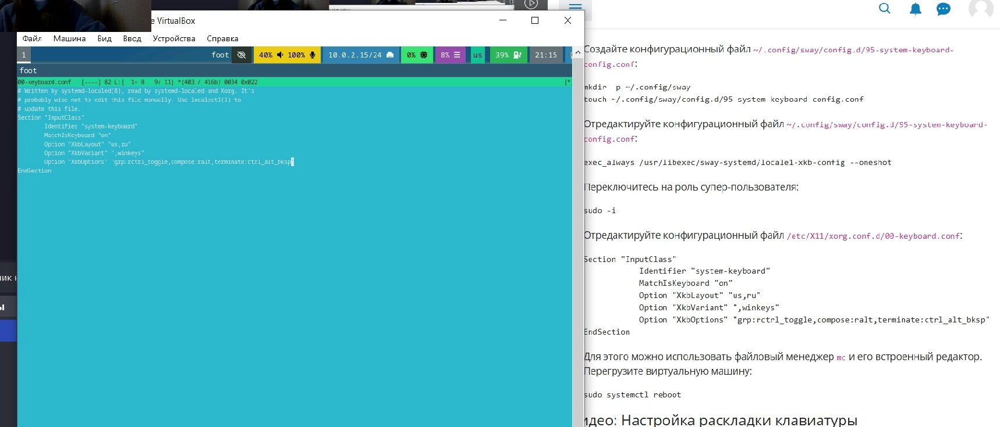
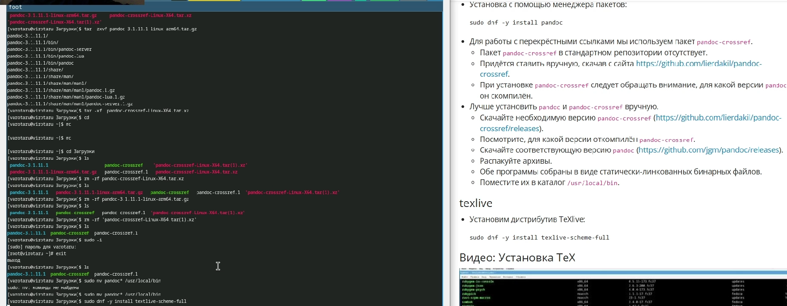
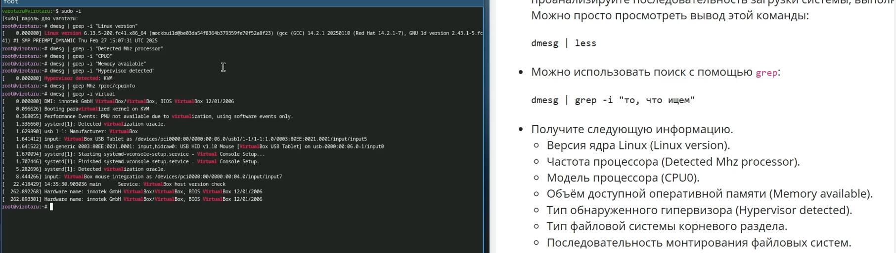

---
## Front matter
title: "Лабараторная работа 1"
subtitle: "Установка ОС Linux."
author: "Ротару Валериа Игоревна"

## Generic otions
lang: ru-RU
toc-title: "Содержание"

## Bibliography
bibliography: bib/cite.bib
csl: pandoc/csl/gost-r-7-0-5-2008-numeric.csl

## Pdf output format
toc: true # Table of contents
toc-depth: 2
lof: true # List of figures
lot: true # List of tables
fontsize: 12pt
linestretch: 1.5
papersize: a4
documentclass: scrreprt
## I18n polyglossia
polyglossia-lang:
  name: russian
  options:
	- spelling=modern
	- babelshorthands=true
polyglossia-otherlangs:
  name: english
## I18n babel
babel-lang: russian
babel-otherlangs: english
## Fonts
mainfont: IBM Plex Serif
romanfont: IBM Plex Serif
sansfont: IBM Plex Sans
monofont: IBM Plex Mono
mathfont: STIX Two Math
mainfontoptions: Ligatures=Common,Ligatures=TeX,Scale=0.94
romanfontoptions: Ligatures=Common,Ligatures=TeX,Scale=0.94
sansfontoptions: Ligatures=Common,Ligatures=TeX,Scale=MatchLowercase,Scale=0.94
monofontoptions: Scale=MatchLowercase,Scale=0.94,FakeStretch=0.9
mathfontoptions:
## Biblatex
biblatex: true
biblio-style: "gost-numeric"
biblatexoptions:
  - parentracker=true
  - backend=biber
  - hyperref=auto
  - language=auto
  - autolang=other*
  - citestyle=gost-numeric
## Pandoc-crossref LaTeX customization
figureTitle: "Рис."
tableTitle: "Таблица"
listingTitle: "Листинг"
lofTitle: "Список иллюстраций"
lotTitle: "Список таблиц"
lolTitle: "Листинги"
## Misc options
indent: true
header-includes:
  - \usepackage{indentfirst}
  - \usepackage{float} # keep figures where there are in the text
  - \floatplacement{figure}{H} # keep figures where there are in the text
---

# Цель работы

Установка ОС на виртуальную машину, настройка минимально необходимых для дальнейшей работы сервисов.

# Задание

	1. Установка Fedora sway на виртуальную машину
	2. Обновление ОС и отключение SELinux
	3. Настройка раскладки клавиатуры
	4. Работа с языком разметки Markdown
	5. Домашнее задание
	6. Контрольные вопросы

# Теоретическое введение

Здесь описываются теоретические аспекты, связанные с выполнением работы.

Например, в табл. [-@tbl:std-dir] приведено краткое описание стандартных каталогов Unix.

: Описание некоторых каталогов файловой системы GNU Linux {#tbl:std-dir}

| Имя каталога | Описание каталога                                                                                                          |
|--------------|----------------------------------------------------------------------------------------------------------------------------|
| `/`          | Корневая директория, содержащая всю файловую                                                                               |
| `/bin `      | Основные системные утилиты, необходимые как в однопользовательском режиме, так и при обычной работе всем пользователям     |
| `/etc`       | Общесистемные конфигурационные файлы и файлы конфигурации установленных программ                                           |
| `/home`      | Содержит домашние директории пользователей, которые, в свою очередь, содержат персональные настройки и данные пользователя |
| `/media`     | Точки монтирования для сменных носителей                                                                                   |
| `/root`      | Домашняя директория пользователя  `root`                                                                                   |
| `/tmp`       | Временные файлы                                                                                                            |
| `/usr`       | Вторичная иерархия для данных пользователя                                                                                 |

Более подробно про Unix см. в [@tanenbaum_book_modern-os_ru; @robbins_book_bash_en; @zarrelli_book_mastering-bash_en; @newham_book_learning-bash_en].

# Выполнение лабораторной работы

	1. Установка Fedora sway на виртуальную машину(см. Р_1)
	
{width=70%}
	Установка Fedora(Р_1)
	
	2. Обновление ОС и отключение SELinux(см. Р_2)
	
{width=70%}
	Обновление(Р_2)
	
	3. Настройка раскладки клавиатуры(см. Р_3)
	
{width=70%}
	Настройка раскладки(Р_3)
	
	4. Работа с языком разметки Markdown(см. Р_4)
	
{width=70%}
	Markdown(Р_4)
	
	5. Домашнее задание(см. Р_5)
	
{width=70%}
	Получение информации о пк(Р_5)
	
	6. Контрольные вопросы
	
	1. Какую информацию содержит учетная запись пользователя?

•   Имя пользователя (username)
•   Идентификатор пользователя (UID)
•   Групповой идентификатор (GID)
•   Пароль (password)
•   Домашний каталог (home directory)
•   Оболочка (shell)
•   Дополнительные атрибуты: Могут включать полное имя пользователя, адрес электронной почты, номер телефона и другие данные.

	2. Укажите команды терминала и приведите примеры:

•   Для получения справки по команде:
    *   man <команда> (например, man ls - выводит справку по команде ls).
    *   <команда> --help (например, ls --help - выводит краткую справку по команде ls).
•   Для перемещения по файловой системе:
    *   cd <путь> (например, cd /home/user/documents - переходит в каталог documents).
    *   cd (без аргументов - переходит в домашний каталог).
    *   cd .. (переходит на уровень выше в файловой системе).
•   Для просмотра содержимого каталога:
    *   ls (выводит список файлов и каталогов в текущем каталоге).
    *   ls -l (выводит подробный список файлов и каталогов с информацией о правах доступа, владельце, размере и дате изменения).
    *   ls -a (выводит все файлы и каталоги, включая скрытые, начинающиеся с точки).
•   Для определения объёма каталога:
    *   du -sh <каталог> (например, du -sh /home/user/documents - выводит общий размер каталога в читаемом формате).
    *   du -h --max-depth=1 <каталог> (выводит размеры подкаталогов в читаемом формате).
•   Для создания / удаления каталогов / файлов:
    *   mkdir <имя_каталога> (создает новый каталог).
    *   rmdir <имя_каталога> (удаляет пустой каталог).
    *   touch <имя_файла> (создает пустой файл).
    *   rm <имя_файла> (удаляет файл).
    *   rm -r <имя_каталога> (удаляет каталог и все его содержимое). Внимание: использовать с осторожностью!
•   Для задания определённых прав на файл / каталог:
    *   chmod <права> <имя_файла> (например, chmod 755 script.sh - устанавливает права на исполнение для владельца и чтение для группы и остальных).
•   Для просмотра истории команд:
    *   history (выводит список ранее введенных команд).
    *   !номер_команды (выполняет команду из истории под указанным номером).
    *   Ctrl+R (поиск в истории команд).

	3. Что такое файловая система? Приведите примеры с краткой характеристикой.

Файловая система - это способ организации хранения данных на носителе информации (например, на жестком диске, SSD, USB-накопителе). Она определяет структуру каталогов и файлов, правила именования, права доступа и другие параметры.

Примеры файловых систем:

•   ext4: Наиболее распространенная файловая система в Linux. Журналируемая, надежная, поддерживает большие размеры файлов и разделов.
•   NTFS: Стандартная файловая система в Windows. Журналируемая, поддерживает права доступа, шифрование и другие функции.
•   FAT32: Устаревшая файловая система, широко использовавшаяся в прошлом. Простая, совместима с разными операционными системами, но имеет ограничения на размер файлов (до 4 ГБ).
•   APFS: Современная файловая система Apple, используемая в macOS, iOS и других устройствах. Оптимизирована для SSD, поддерживает клонирование, моментальные снимки и другие функции.

	4. Как посмотреть, какие файловые системы подмонтированы в ОС?

Можно использовать следующие команды:

•   mount (выводит список всех подмонтированных файловых систем).
•   df -h (выводит информацию о занятом и свободном месте на подмонтированных файловых системах).
•   cat /etc/fstab (показывает конфигурационный файл, определяющий, какие файловые системы должны быть подмонтированы при загрузке системы).

# Выводы

Я приобрела практические навыки установки операционной системы на виртуальную машину и узнала её основные команды.

# Список литературы{.unnumbered}

::: {#refs}
:::
